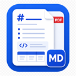

# Markdown PDF Viewer

<p align="center">
  
</p>

[日本語](#日本語) / [English](#english)

## 日本語

Markdown PDF Viewer は、GitHub や GitHub Raw URL の Markdown ファイルを、ブラウザ上でPDF風に整形表示する Chrome / Edge 拡張機能です。

設計メモ、研究資料、FPGA関連ドキュメント、技術仕様書など、Markdownで管理している資料を見やすく確認・印刷するためのツールです。

### 機能

- GitHub上のMarkdownファイルをPDF風ビューアで表示
- `raw.githubusercontent.com` のMarkdownファイルを直接表示
- 対応ページ上部に `PDF表示` と `印刷` ボタンを追加
- 見出し、リスト、コードブロック、引用、画像、リンク、表を変換
- 見出しから目次を自動生成
- ブラウザの印刷機能でPDF保存や印刷が可能
- 拡張機能ポップアップからローカルMarkdownファイルを表示
- 拡張機能UIは日本語と英語に対応

### 開発用インストール

1. Chrome または Edge を開きます。
2. `chrome://extensions` または `edge://extensions` を開きます。
3. デベロッパーモードを有効にします。
4. `パッケージ化されていない拡張機能を読み込む` を選びます。
5. このリポジトリ内の `extension/` フォルダを選択します。

ファイルを変更した後は、拡張機能ページで拡張機能を再読み込みし、対象のMarkdownページも再読み込みしてください。

### 使い方

GitHubのMarkdownページを開きます。

```text
https://github.com/user/repository/blob/main/docs/sample.md
```

ページ上部に追加されるボタンを使います。

- `PDF表示`: PDF風ビューアで開く
- `印刷`: PDF風ビューアを開き、印刷ダイアログを表示

Raw URLでも同じように使えます。

```text
https://raw.githubusercontent.com/user/repository/main/docs/sample.md
```

拡張機能アイコンをクリックすると、現在のタブ、手入力URL、ローカル `.md` ファイルからも開けます。

### 構成

| パス | 役割 |
| --- | --- |
| `extension/` | Chrome / Edge 拡張機能本体 |
| `extension/manifest.json` | Chrome拡張の設定 |
| `extension/_locales/` | 日本語・英語の翻訳 |
| `extension/i18n.js` | 拡張機能画面の翻訳適用 |
| `extension/background.js` | content script から依頼されたビューアタブを開く |
| `extension/content-script.js` | GitHub Markdownページにボタンを追加 |
| `extension/popup.html` / `extension/popup.js` / `extension/popup.css` | 拡張機能ポップアップ |
| `extension/viewer.html` / `extension/viewer.js` / `extension/viewer.css` | PDF風Markdownビューア |
| `.github/workflows/validate.yml` | 検証用GitHub Actions |
| `.github/workflows/release.yml` | 自動リリース用GitHub Actions |
| `architecture.md` | 要件・設計メモ |

### 検証

```powershell
node --check extension/background.js
node --check extension/content-script.js
node --check extension/i18n.js
node --check extension/markdown.js
node --check extension/popup.js
node --check extension/viewer.js
node -e "JSON.parse(require('fs').readFileSync('extension/manifest.json','utf8'))"
```

### リリース

タグをpushすると、GitHub Actionsが配布パッケージ内の `extension/manifest.json` の `version` をタグに合わせてから、配布用zipを作成してReleaseを公開します。

```powershell
git tag v1.0.0
git push origin v1.0.0
```

GitHubのActions画面から `Release` ワークフローを手動実行することもできます。その場合も `v1.0.0` のようなタグ名を指定してください。

配布zipは、展開したフォルダの直下に `manifest.json` が見える形で作成されます。

## English

Markdown PDF Viewer is a Chrome / Edge extension that opens Markdown files from GitHub or GitHub Raw URLs in a clean, PDF-style browser preview.

It is intended for design notes, research documents, FPGA documentation, technical specifications, and other Markdown-based documents that need to be reviewed or printed neatly.

### Features

- Open GitHub Markdown files in a PDF-style viewer
- Open `raw.githubusercontent.com` Markdown files directly
- Add `Open PDF View` and `Print` buttons to supported pages
- Convert headings, lists, code blocks, blockquotes, images, links, and tables
- Generate a table of contents from headings
- Print or save as PDF using the browser print dialog
- Open local Markdown files from the extension popup
- Support English and Japanese extension UI

### Install for Development

1. Open Chrome or Edge.
2. Go to `chrome://extensions` or `edge://extensions`.
3. Enable developer mode.
4. Choose `Load unpacked`.
5. Select the `extension/` folder in this repository.

After changing files, reload the extension from the extensions page and then reload the target Markdown page.

### Usage

Open a Markdown file on GitHub.

```text
https://github.com/user/repository/blob/main/docs/sample.md
```

Use the buttons added near the top of the page.

- `Open PDF View`: open the document in the PDF-style viewer
- `Print`: open the viewer and show the print dialog

Raw URLs work the same way.

```text
https://raw.githubusercontent.com/user/repository/main/docs/sample.md
```

You can also use the extension popup to open the current tab, enter a Markdown URL manually, or open a local `.md` file.

### Project Files

| Path | Purpose |
| --- | --- |
| `extension/` | Chrome / Edge extension source |
| `extension/manifest.json` | Chrome extension manifest |
| `extension/_locales/` | English and Japanese translations |
| `extension/i18n.js` | Applies translations in extension pages |
| `extension/background.js` | Opens viewer tabs from content scripts |
| `extension/content-script.js` | Adds page buttons to GitHub Markdown pages |
| `extension/popup.html` / `extension/popup.js` / `extension/popup.css` | Extension popup UI |
| `extension/viewer.html` / `extension/viewer.js` / `extension/viewer.css` | PDF-style Markdown viewer |
| `.github/workflows/validate.yml` | Validation GitHub Actions workflow |
| `.github/workflows/release.yml` | Automated release GitHub Actions workflow |
| `architecture.md` | Architecture and requirements notes |

### Development Checks

```powershell
node --check extension/background.js
node --check extension/content-script.js
node --check extension/i18n.js
node --check extension/markdown.js
node --check extension/popup.js
node --check extension/viewer.js
node -e "JSON.parse(require('fs').readFileSync('extension/manifest.json','utf8'))"
```

### Release

When you push a release tag, GitHub Actions updates the packaged `extension/manifest.json` version to match the tag, creates a release zip, and publishes a GitHub Release.

```powershell
git tag v1.0.0
git push origin v1.0.0
```

You can also run the `Release` workflow manually from the GitHub Actions page. Use a tag name such as `v1.0.0`.

The release zip is created so that `manifest.json` is directly visible at the extracted folder root.
